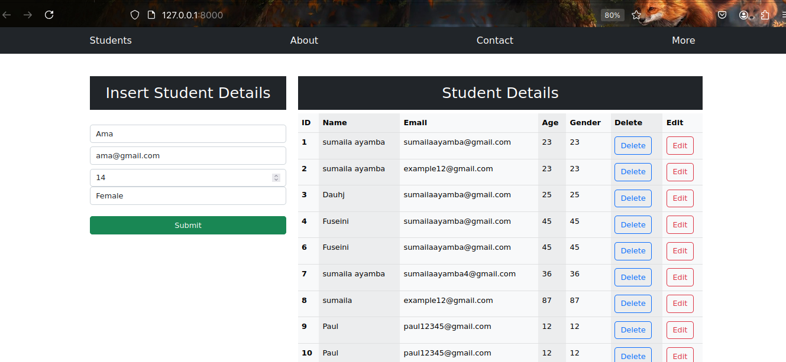

# Student Record Management System

## Overview
The **Student Record Management System** is a Django-based application designed to manage student data effectively. This system allows administrators to add, update, delete, and view student details, streamlining the management of student records in schools, colleges, and other educational institutions.

## Key Features
- **Admin Access:** Only admins can add, update, or delete student records, ensuring data integrity and security.
- **CRUD Operations:** Full functionality to Create, Read, Update, and Delete student records.
- **Detailed Student Profiles:** Stores comprehensive student information, including name, age, grade, contact details, and other particulars.
- **User-Friendly Interface:** Designed with a simple and intuitive interface for efficient management of student data.
- **Search and Filter:** Quickly locate student records with built-in search and filter capabilities.

## Tech Stack
- **Django:** The main framework used to build the backend of the application.
- **SQLite / PostgreSQL:** Database used to store student records and admin credentials.
- **Django Admin:** Powerful admin interface for easy data management.

## Installation and Setup
1. **Clone the Repository:**
   ```bash
   git clone https://github.com/AyambaSumaila/students-crud-app-django.git
   ```
2. **Navigate to the Project Directory:**
   ```bash
   cd student-record-management-system
   ```
3. **Create a Virtual Environment:**
   ```bash
   python -m venv env
   ```
4. **Activate the Virtual Environment:**
   - On Windows:
     ```bash
     env\Scripts\activate
     ```
   - On macOS/Linux:
     ```bash
     source env/bin/activate
     ```
5. **Install Dependencies:**
   ```bash
   pip install -r requirements.txt
   ```
6. **Apply Migrations:**
   ```bash
   python manage.py migrate
   ```
7. **Create a Superuser:**
   ```bash
   python manage.py createsuperuser
   ```
8. **Run the Server:**
   ```bash
   python manage.py runserver
   ```

## API Endpoints
- **POST /api/students/** - Add a new student record (admin only).
- **GET /api/students/** - Retrieve a list of all student records.
- **GET /api/students/<id>/** - Retrieve details of a specific student by ID.
- **PUT /api/students/<id>/** - Update an existing student record (admin only).
- **DELETE /api/students/<id>/** - Delete a student record (admin only).



## Authentication and Permissions
- **Admin Access:** Only users with admin privileges can manage student records, ensuring that data is handled securely and responsibly.
- **Permissions:** Configured to restrict CRUD operations to admins, preventing unauthorized access or data tampering.

## Importance in Real-World Applications
1. **Efficient Data Management:** Simplifies the process of managing large volumes of student data, reducing manual errors and saving time.
2. **Enhanced Security:** By limiting access to administrators, the system ensures that sensitive student information is protected from unauthorized access.
3. **Scalable Solution:** Easily adaptable to different educational institutions, from small schools to large universities.
4. **Improves Decision Making:** Accurate and up-to-date records help educational institutions make informed decisions about student needs and performance.
5. **Compliance and Reporting:** Facilitates compliance with educational standards and provides easy access to records for audits and reports.

## Future Enhancements
- **Role-Based Access Control:** Implement more user roles, such as teachers or registrars, with limited access permissions.
- **Integration with External Systems:** Connect with other educational tools and platforms for enhanced functionality.
- **Automated Reporting:** Generate automated reports on student performance, attendance, and other metrics.

## Contributing
We welcome contributions! Feel free to fork the repository, work on your changes, and create a pull request.

## License
This project is licensed under the MIT License.

---

Let me know if you'd like to make any tweaks or add more details!